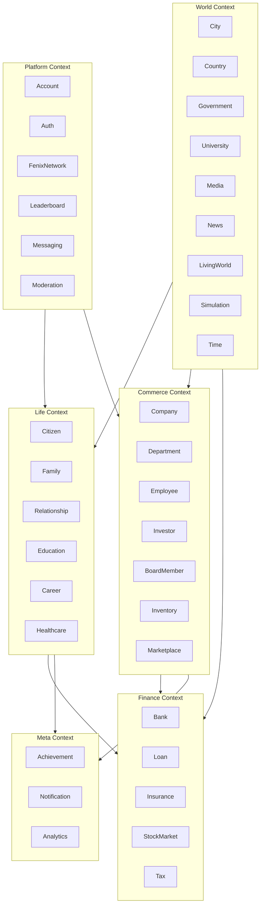
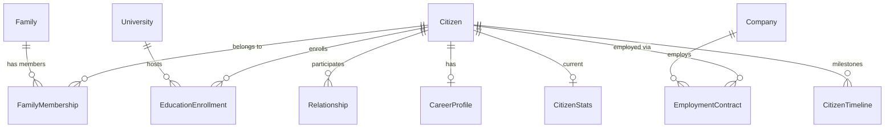
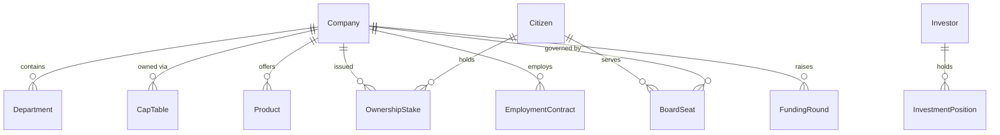
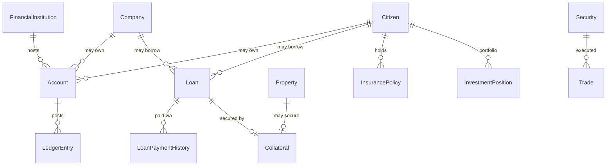
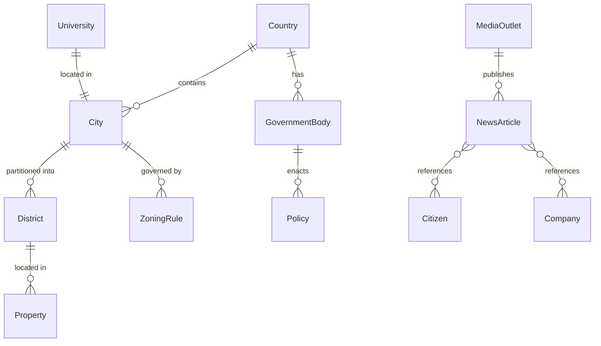
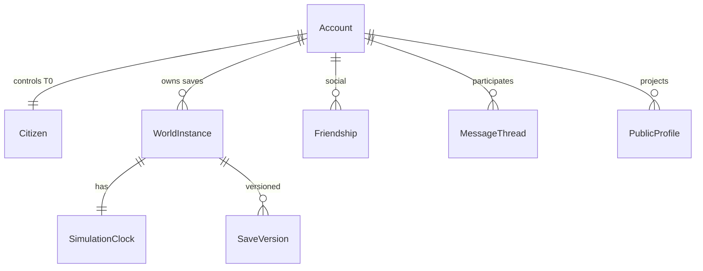
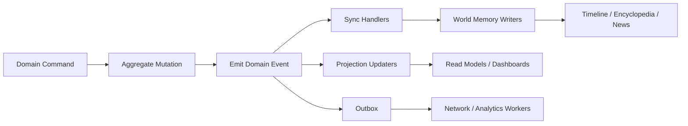
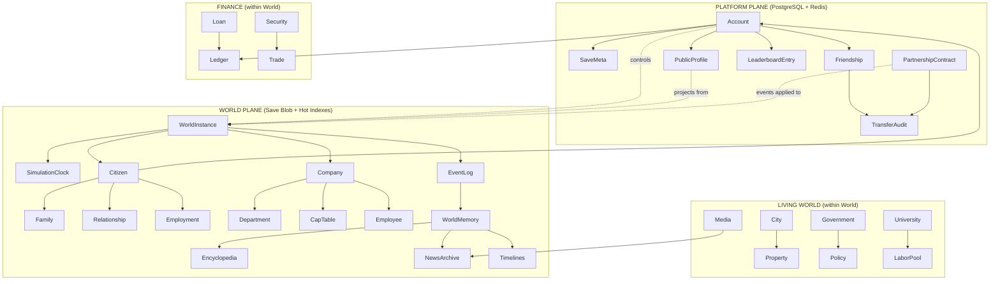

# Fenix Life — Official Database Design Document (DDD)

**Document Version:** 1.0  
**Status:** Canonical — Data Architecture Source of Truth  
**Last Updated:** July 10, 2026  
**Owner:** Chief Database Architect & Principal Data Engineering  
**Audience:** Engineering, Data, AI Systems, Platform, QA, Live Ops, Security  

---

## Document Authority

This Database Design Document defines **how Fenix Life stores, preserves, queries, and scales data** for the next 10–15 years. It is subordinate to, and must not contradict:

| Document | Role |
|---|---|
| [FENIX-LIFE-PRODUCT-BIBLE.md](../prd/FENIX-LIFE-PRODUCT-BIBLE.md) | Product vision, pillars, loops, economy, multiplayer philosophy |
| [Fenix-Life-Design-Constitution.md](./Fenix-Life-Design-Constitution.md) | Immutable design law: Citizen Equality, World Memory, Five Capitals, Dynamic History |
| [Fenix-Life-Technical-Design-Document.md](./Fenix-Life-Technical-Design-Document.md) | System architecture, modules, event bus, save system, scalability targets |

When data modeling trade-offs conflict with product philosophy, **align with philosophy first**, then document deliberate technical exceptions with rationale and migration path.

This document does **not** contain SQL migrations, Prisma schemas, or implementation code. It defines conceptual entities, storage strategies, relationships, and operational policies that implementation teams must follow.

Every table, aggregate, index, and storage decision must trace to:

1. A Product Bible pillar (§4)
2. A Design Constitution article
3. A section of the TDD
4. A section of this document

---

## Table of Contents

1. [Database Philosophy](#1-database-philosophy)
2. [Core Domains](#2-core-domains)
3. [Historical Data Model](#3-historical-data-model)
4. [Relationships](#4-relationships)
5. [Event Storage](#5-event-storage)
6. [Performance Strategy](#6-performance-strategy)
7. [Multiplayer Data](#7-multiplayer-data)
8. [Save System](#8-save-system)
9. [Analytics](#9-analytics)
10. [Future-Proofing](#10-future-proofing)
11. [Deliverables Reference](#11-deliverables-reference)

---

## Executive Summary

Fenix Life is a **historical simulation**. The database is not merely a container for current state—it is the **memory of the world**.

The data architecture separates three storage planes:

| Plane | Purpose | Primary Technology |
|---|---|---|
| **Platform Plane** | Accounts, Fenix Network, auth, moderation, leaderboards | PostgreSQL (normalized) + Redis |
| **World Plane** | Sovereign simulation state per save | Compressed save blobs + structured hot indexes |
| **Memory Plane** | Immutable history, events, archives, encyclopedia | Append-only event log + partitioned history tables + cold blob archives |

**North-star data constraints:**

| Constraint | Source |
|---|---|
| Nothing important is permanently lost | Constitution Article V (World Memory), Article IX (Dynamic History) |
| Player and AI citizens share data shapes | Symmetry Principle — Constitution Article I |
| Sovereign worlds do not share mutable state | Product Bible §9, TDD §5 |
| History is queryable across decades of in-game time | Product Bible §10, TDD §3.5 |
| Saves survive 15+ years of schema evolution | TDD §7, §13 |

---

# 1. Database Philosophy

## 1.1 The World Remembers

Fenix Life treats time as a first-class dimension. The default operation on consequential data is **append**, not **overwrite**. Current state is a **projection** derived from the latest facts plus an authoritative snapshot for performance—not the only record that ever existed.

This philosophy directly implements **World Memory** (Constitution Article V) and **Dynamic History** (Article IX). When a citizen's salary changes, the system retains prior compensation periods. When a company changes ownership, prior cap table states remain auditable. When a government changes policy, prior policy versions explain why a loan approved in 2031 differs from one in 2044.

## 1.2 Normalization vs. Denormalization

Fenix Life uses a **pragmatic hybrid**:

| Pattern | When Used | Rationale |
|---|---|---|
| **Third Normal Form (3NF)** | Platform plane, contracts, ledgers, identity | Integrity, auditability, multi-tenant safety |
| **Aggregate documents** | World save hot state, citizen personality bundles | Read performance, serialization to blob |
| **Denormalized projections** | Dashboards, leaderboards, public profiles, news feeds | CQRS read models fed by events |
| **JSON columns** | Extensible attributes, mod hooks, variable industry metadata | Future-proofing without schema explosion |

**Rule:** Normalize **facts that must never disagree** (money ledger entries, ownership stakes, relationship edges). Denormalize **views that can be rebuilt** (net worth summary, company KPI cards, leaderboard rows).

## 1.3 Performance Philosophy

Performance serves believability, not the reverse.

| Principle | Application |
|---|---|
| **Write once, read many** | Historical tables append-only; materialized views refresh asynchronously |
| **Tiered fidelity** | T0 player data fully relational inside save; T3 city aggregates are statistical |
| **Batch by tick boundary** | Simulation writes flush at tick completion, not per micro-action |
| **Hot/warm/cold tiers** | Recent 5 in-game years hot; older years compressed and partition-pruned |
| **Cache is disposable** | Redis holds projections; PostgreSQL + blob store are authoritative |

Target scale (from TDD §6.1): millions of citizens and companies **per world** at aggregate tier; thousands of fully modeled entities in hot storage.

## 1.4 Historical Storage Philosophy

History is stored at three resolutions:

1. **Atomic facts** — ledger postings, ownership transfers, relationship deltas (never deleted)
2. **Interval records** — employment periods, marriage periods, policy regimes, property ownership spans (end-dated, not overwritten)
3. **Narrative artifacts** — news articles, biographies, encyclopedia entries, timeline cards (generated from facts, retained permanently)

Annual rollup jobs compress high-frequency telemetry (daily stock ticks, minor relationship drift) into summary statistics while preserving **milestone events** at full fidelity.

## 1.5 Data Ownership

Clear ownership prevents coupling and corruption across modules.

| Owner | Owns | Does Not Own |
|---|---|---|
| **Citizen** | Identity, vitals, personality, aging, death | Bank accounts, job contracts |
| **Family** | Marriage contracts, children lineage, inheritance structures, dynasty reputation | Relationship meters (bidirectional) |
| **Relationships** | Social meters, interaction history | Legal marriage records |
| **Banking** | Accounts, ledger, loans, credit history | Tax policy rates |
| **Company** | Cap table, departments, products, valuation snapshots | Individual payroll line items (Employee) |
| **Employee** | Employment contracts, compensation history, performance | Company strategy |
| **Living World Engine** | Institutions, city regions, labor pools, NPC aggregates | Player UI projections |
| **Fenix Network** | Friend graph, cross-player contracts, public profiles | In-world citizen relationships |
| **Save Service** | Save metadata, version chain, blob pointers | Simulation business logic |
| **World Memory** | Event log, encyclopedia, newspaper archive | Current mutable aggregates |

**Cross-module rule:** Modules exchange **foreign keys by stable ID** and **events by contract**—never by reaching into another module's internal tables.

## 1.6 Scalability Philosophy

Scale horizontally at the **platform** layer; scale vertically and by **tiering** at the **world** layer.

| Dimension | Strategy |
|---|---|
| Accounts | PostgreSQL with read replicas; shard by region if needed (phase 3) |
| Worlds | One authoritative blob per save; optional cloud worker per heavy catch-up |
| Citizens (in-world) | Agent tiers T0–T3; promote on interaction |
| Events | Partition by `world_instance_id` + in-game year |
| History | Yearly partitions; cold storage to blob after rollup |
| Network | Normalized contract tables; immutable transfer log |

## 1.7 Archiving Philosophy

Archiving is **compression with retrieval path**, not deletion.

| Lifecycle Stage | Age Trigger | Storage Form |
|---|---|---|
| **Hot** | Current + last 5 in-game years | Indexed PostgreSQL or in-save structures |
| **Warm** | 6–50 in-game years | Partitioned tables, reduced indexes |
| **Cold** | 50+ in-game years | ZSTD-compressed yearly bundles in blob storage |
| **Canonical** | Milestone events | Never archived below full fidelity |

Players access cold history through **lazy hydration**—summary first, detail on demand (newspaper archive, family tree, encyclopedia).

## 1.8 Versioning Philosophy

Every persisted artifact carries version metadata:

| Artifact | Version Field | Meaning |
|---|---|---|
| Save package | `schema_version` | Structural migration independent of game version |
| Domain events | `schema_version` | Payload evolution with backward-compatible readers |
| Mod manifests | `api_tier` + `min_engine_version` | Compatibility matrix |
| Projections | `projection_version` | Rebuild trigger when logic changes |
| Platform API | SemVer | External contract |

**Rule:** Readers must tolerate `N` and `N-1` schema versions during migration windows.

## 1.9 Soft Deletes

Soft deletes apply to **platform entities** and **revocable relationships**—not to simulation facts.

| Entity Class | Delete Strategy |
|---|---|
| Accounts | Soft delete + 30-day recovery (TDD §7.5) |
| Friendships, blocks | Soft delete with `ended_at` |
| Messages (DMs) | Soft delete per-user visibility |
| Companies (in-world) | **No delete** — bankruptcy → `status = defunct` |
| Citizens | **No delete** — death → `status = deceased` |
| Ledger entries | **Immutable** — reversal via compensating entry |
| Events | **Immutable** — never deleted |

## 1.10 Immutable Records

The following are **append-only forever**:

- World event log entries
- Bank ledger postings
- Stock trade executions
- Tax assessments and filings
- Ownership transfer records
- Cross-player transfer audit log
- Moderation and admin audit log (7-year retention minimum)
- Major life events (birth, marriage, death, IPO, bankruptcy)

Immutability supports: World Memory, anti-cheat, dispute resolution, historical reporting, and deterministic replay (TDD §11.5).

## 1.11 Audit Logs

Audit logs are a specialized immutable stream with stricter access control:

| Audit Stream | Captures |
|---|---|
| `platform_audit` | Admin actions, entitlement changes, ban decisions |
| `transfer_audit` | Fenix Network gifts, investments, partnerships above thresholds |
| `save_audit` | Cloud restore, migration, corruption recovery |
| `simulation_audit` | Determinism checksum failures, anomalous stat flags |

Audit records are **not** player-facing by default but support moderation, support tooling, and compliance.

---

# 2. Core Domains

## 2.1 Domain Architecture Overview

Fenix Life domains cluster into five bounded contexts that map to simulation modules (TDD §2.2):



## 2.2 Domain Catalog

### Citizen

**Responsibility:** The atomic unit of the simulation—one human life.

**Core entities:**
- `Citizen` — identity root (name, birth date, citizenship, genetics seed, player control flag)
- `CitizenProfile` — personality, aspirations, risk tolerance, behavioral tendencies
- `CitizenStats` — health, happiness, energy, stress, morality (current snapshot)
- `CitizenStatus` — life stage, alive/deceased, playable heir eligibility

**Historical entities:**
- `CitizenStatHistory` — time-series vitals
- `CitizenBiography` — generated at death from event aggregation
- `CitizenTimeline` — curated milestone cards for UI

**Pillars served:** Living Life (I), Living Legacy (VI)  
**Capitals:** Human, Social, Financial (indirect)

**Storage note:** T0/T1 citizens are fully modeled. T2/T3 exist as statistical pool entries in Living World aggregates until promoted.

---

### Family

**Responsibility:** Legal and dynastic structures binding citizens across generations.

**Core entities:**
- `Family` — dynasty root, family name, reputation score
- `FamilyMembership` — citizen ↔ family role (child, parent, head of household)
- `Household` — cohabiting unit for shared economics
- `MarriageRecord` — legal union with regime type (community property, prenup)
- `DivorceSettlement` — asset division outcome
- `InheritancePlan` — will, trust, beneficiary designations
- `SuccessionCandidate` — heir eligibility tracking

**Historical entities:**
- `MarriageHistory` — union and dissolution intervals
- `InheritanceEvent` — distributions with tax and dispute outcomes
- `DynastyReputationHistory` — family name standing over time

**Pillars:** Living Life, Living Legacy  
**Capitals:** Social, Legacy, Financial

---

### Relationship

**Responsibility:** Bidirectional social bonds and their accumulated history.

**Core entities:**
- `Relationship` — edge between two citizens (type: friend, rival, mentor, romantic)
- `RelationshipMeters` — trust, romance, conflict, respect (current)
- `InteractionLog` — significant social actions

**Historical entities:**
- `RelationshipMeterHistory` — sampled or event-triggered meter changes
- `BetrayalRecord` — flagged inflection points (World Memory)

**Distinction:** In-world `Relationship` is simulation-local. Fenix Network `Friendship` is platform-global (§7).

**Capitals:** Social

---

### Education

**Responsibility:** Learning paths, credentials, and institutional enrollment.

**Core entities:**
- `EducationEnrollment` — citizen ↔ institution ↔ program
- `CourseRecord` — completed courses, grades
- `Credential` — degrees, certifications, licenses (with expiry)
- `StudentLoanLink` — binding to Banking loan accounts

**Historical entities:**
- `EducationHistory` — enrollment periods
- `Transcript` — immutable grade record per term
- `AlumniAffiliation` — post-graduation network hooks

**Capitals:** Human, Social

---

### Career

**Responsibility:** Labor market participation outside of full company ownership context.

**Core entities:**
- `CareerProfile` — current career track, industry, seniority
- `JobApplication` — pipeline state
- `UnemploymentPeriod` — gaps with benefits eligibility

**Historical entities:**
- `CareerHistory` — arc summary
- `JobSearchEpisode` — applications and outcomes

**Boundaries:** Active employment contracts live in `Employee`; Career owns the arc and search.

**Capitals:** Human, Financial, Social

---

### Employment / Employee

**Responsibility:** The contractual bond between a citizen and a company.

**Core entities:**
- `EmploymentContract` — role, department, start date, compensation terms
- `CompensationPackage` — salary, bonus structure, equity grant reference
- `PerformanceReview` — periodic evaluations
- `PromotionRecord` — title changes

**Historical entities:**
- `EmploymentHistory` — all positions with date ranges (never overwritten)
- `SalaryHistory` — compensation intervals
- `EquityGrantHistory` — vesting snapshots

**Capitals:** Human, Financial, Business (for executives)

---

### Company

**Responsibility:** Legal business entity with lifecycle from founding through exit or bankruptcy.

**Core entities:**
- `Company` — legal identity, incorporation date, sector, status
- `CapTable` — ownership stakes (current snapshot)
- `CompanyFinancials` — P&L, balance sheet, cash flow (periodic snapshots)
- `Valuation` — current estimated enterprise value
- `Product` — offerings with quality, market fit metrics
- `Brand` — reputation, awareness, trust scores
- `CompanyProfile` — public-facing summary for media and Network

**Historical entities:**
- `CompanyTimeline` — founding, funding, IPO, scandals, bankruptcy
- `CapTableHistory` — ownership changes per funding round
- `ValuationHistory` — periodic and event-driven valuations
- `EarningsHistory` — quarterly/annual reports

**Symmetry Principle:** NPC and player companies share identical entity shapes.

**Capitals:** Business, Financial

---

### Department

**Responsibility:** Organizational unit within a company—gameplay vector for operations.

**Core entities:**
- `Department` — type (R&D, Marketing, HR, Finance, etc.), budget, headcount
- `DepartmentKPI` — current performance indicators
- `DepartmentBudget` — allocated spend per period

**Historical entities:**
- `DepartmentBudgetHistory`
- `DepartmentPerformanceHistory`

**Capitals:** Business

---

### Investor

**Responsibility:** External capital providers and their relationship to portfolio companies.

**Core entities:**
- `Investor` — citizen or institution identity as investor
- `InvestmentPosition` — stake in private company
- `FundingRound` — round terms, participants, dilution impact
- `InvestorRelationship` — trust, track record between founder and investor

**Historical entities:**
- `InvestmentHistory` — round participation log
- `ReturnRealization` — exit proceeds, write-offs

**Capitals:** Financial, Business

---

### Board Member

**Responsibility:** Governance role linking citizens to company oversight.

**Core entities:**
- `BoardSeat` — citizen ↔ company with role (chair, independent, founder)
- `BoardVote` — decisions (acquisition approval, CEO removal)
- `GovernancePolicy` — bylaws, voting thresholds

**Historical entities:**
- `BoardVoteHistory`
- `CEOTenureHistory`

**Capitals:** Business, Social, Legacy

---

### Stock Market

**Responsibility:** Public securities, price discovery, and trading infrastructure.

**Core entities:**
- `Security` — tradable instrument linked to company
- `Listing` — exchange, ticker, float, listing status
- `MarketPrice` — current price (snapshot)
- `Order` — pending trade intent
- `Trade` — executed transaction (immutable)

**Historical entities:**
- `PriceHistory` — OHLC at configurable granularity
- `DividendHistory`
- `TradingHaltRecord`
- `DelistingRecord`

**Capitals:** Financial

---

### Bank

**Responsibility:** Depository, lending, and payment rail for citizens and companies.

**Core entities:**
- `FinancialInstitution` — bank identity (player-facing and NPC)
- `Account` — checking, savings, business operating
- `LedgerEntry` — double-entry posting (immutable)
- `CreditProfile` — credit score, factors (current)

**Historical entities:**
- `AccountBalanceHistory` — daily or monthly snapshots
- `CreditScoreHistory`
- `BankRelationshipHistory` — institution-level trust

**Capitals:** Financial

---

### Loan

**Responsibility:** Debt instruments with lifecycle from application through payoff or default.

**Core entities:**
- `Loan` — principal, rate, term, collateral reference
- `LoanSchedule` — amortization plan
- `Collateral` — linked asset (property, vehicle)

**Historical entities:**
- `LoanPaymentHistory` — immutable payment records
- `LoanModificationHistory` — refinances, restructures
- `DefaultRecord` — World Memory inflection

**Capitals:** Financial

---

### Insurance

**Responsibility:** Risk transfer products affecting health, property, and liability.

**Core entities:**
- `InsurancePolicy` — coverage terms, premium, beneficiary
- `InsuranceClaim` — filed claims with outcome

**Historical entities:**
- `PremiumPaymentHistory`
- `ClaimHistory`

**Capitals:** Financial, Human

---

### Vehicle

**Responsibility:** Owned transport assets with financing and depreciation.

**Core entities:**
- `Vehicle` — make, model, condition, ownership
- `VehicleFinancing` — linked loan if applicable

**Historical entities:**
- `VehicleOwnershipHistory`
- `VehicleValueHistory` — depreciation curve

**Capitals:** Financial

---

### Property

**Responsibility:** Real estate titles, economics, and spatial linkage to city.

**Core entities:**
- `Property` — parcel identity, type (residential, commercial), attributes
- `PropertyTitle` — current owner (citizen or company)
- `Mortgage` — linked loan
- `Lease` — rental terms if tenant-occupied

**Historical entities:**
- `PropertyOwnershipHistory` — chain of title
- `PropertyValueHistory` — appraisals, market estimates
- `RentCollectionHistory`

**Capitals:** Financial, Legacy

---

### City

**Responsibility:** Urban simulation unit—districts, demand, growth, spatial indexing.

**Core entities:**
- `City` — identity within country
- `District` — region partition for simulation
- `ZoningRule` — land use policy per district
- `CityDemographics` — aggregate population statistics
- `CityEconomy` — local indices (employment, housing, commercial rent)

**Historical entities:**
- `CityGrowthHistory`
- `DistrictDevelopmentHistory`
- `HousingIndexHistory`

**Capitals:** Business, Financial (indirect)

---

### Country

**Responsibility:** National container for law, currency, and macroeconomic context.

**Core entities:**
- `Country` — legal jurisdiction, currency, regulatory framework
- `NationalEconomy` — macro indicators snapshot

**Historical entities:**
- `MacroIndicatorHistory` — GDP, unemployment, inflation
- `NationalCrisisRecord` — recessions, panics

---

### Government

**Responsibility:** Policy, regulation, elections, enforcement.

**Core entities:**
- `GovernmentBody` — city, state, federal level
- `Policy` — current active policy set
- `Regulation` — industry-specific rules
- `Election` — cycle state, candidates, outcomes
- `GrantProgram` — available public funding

**Historical entities:**
- `PolicyHistory` — versioned policy with effective dates
- `ElectionHistory`
- `RegulatoryActionHistory` — fines, enforcement

**Capitals:** Social, Legacy

---

### University

**Responsibility:** Educational institution as living world actor.

**Core entities:**
- `University` — institution identity, ranking, capacity
- `AcademicProgram` — degree offerings
- `ResearchProject` — outputs affecting local economy
- `GraduateCohort` — pipeline to labor pool

**Historical entities:**
- `EnrollmentStatisticsHistory`
- `ResearchBreakthroughHistory`
- `AlumniImpactHistory`

**Capitals:** Human, Business (spillover)

---

### Media

**Responsibility:** Information layer—outlets, journalists, reputation effects.

**Core entities:**
- `MediaOutlet` — organization identity, bias profile
- `Journalist` — optional named NPC
- `ReputationTag` — applied to citizens/companies from coverage

**Historical entities:**
- `MediaCoverageHistory`
- `ReputationScoreHistory`

**Capitals:** Social, Business

---

### News

**Responsibility:** Player-facing artifacts generated from simulation facts.

**Core entities:**
- `NewsArticle` — headline, body, entities referenced, simulation date
- `NewsFeed` — curated stream per citizen/world

**Historical entities:**
- `NewspaperArchive` — partition by in-game year
- `Obituary` — citizen death artifact
- `EarningsReportArticle` — corporate news subtype

**Rule:** News **reports** simulation; it does not authoritatively mutate domain state except reputation side-effects.

**Capitals:** Social, Legacy

---

### Achievements

**Responsibility:** Milestone tracking and Legacy Score computation.

**Core entities:**
- `Achievement` — definition catalog (platform-level)
- `AchievementUnlock` — per save / per citizen instance
- `LegacyScore` — composite across Five Capitals

**Historical entities:**
- `LegacyScoreHistory` — annual snapshots
- `HallOfLegendsEntry` — exceptional lives

**Capitals:** All five (read-only observer)

---

### Inventory

**Responsibility:** Tangible and intangible held items not covered by dedicated asset modules.

**Core entities:**
- `InventoryItem` — generic asset with type discriminator
- `ItemStack` — quantity, condition

**Historical entities:**
- `ItemTransferHistory`

**Capitals:** Financial

---

### Marketplace

**Responsibility:** Exchange of goods and services between citizens and companies.

**Core entities:**
- `MarketListing` — offer to sell
- `MarketTransaction` — completed exchange (immutable)

**Historical entities:**
- `PriceIndexHistory` — category-level pricing

**Capitals:** Financial, Business

---

### Friendship (Fenix Network)

**Responsibility:** Platform-level social graph between player accounts.

**Core entities:**
- `Friendship` — established relationship with `relationship_age`
- `Block` — enforcement edge
- `FriendRequest` — pending state

**Distinction:** Not the same as in-world `Relationship`. A player may be friends with another player whose citizen lives in a separate sovereign world.

**See §7 for full multiplayer data design.**

---

### Messaging

**Responsibility:** Async communication between accounts.

**Core entities:**
- `MessageThread` — conversation container
- `Message` — content, sender, timestamps
- `DealThread` — specialized thread for investment/partnership negotiation

---

### Notifications

**Responsibility:** Prioritized delivery queue for diegetic and system alerts.

**Core entities:**
- `Notification` — type, priority, payload reference, read state
- `NotificationPreference` — per-channel settings

---

### Simulation

**Responsibility:** Orchestration metadata for world instance execution.

**Core entities:**
- `WorldInstance` — sovereign simulation root
- `SimulationConfig` — difficulty, mod manifest, history depth settings
- `SimulationCheckpoint` — tick boundary checksum
- `AgentTierRegistry` — promotion state for NPCs

**Historical entities:**
- `TickLog` — performance and completion records
- `WhileYouWereAwayDigest` — offline catch-up summary

---

### Living World

**Responsibility:** Aggregate state for NPC populations, institutions, and regional flows.

**Core entities:**
- `LaborPool` — skill/supply by region and sector
- `NPCCompanyAggregate` — statistical firm behaviors at T3
- `InstitutionRegistry` — banks, universities, media outlets as world actors
- `RegionalFlow` — migration, trade, graduate flows

**Historical entities:**
- `SectorCycleHistory`
- `LaborMarketHistory`

---

### Time

**Responsibility:** Calendar, tick schedule, and temporal gates.

**Core entities:**
- `SimulationClock` — current in-game datetime, speed, pause state
- `TickSchedule` — next pending phase boundaries
- `UnresolvedDecisionGate` — blocking decisions before advance

**Historical entities:**
- `CalendarEvent` — scheduled future events (elections, loan due dates)

---

## 2.3 Agent Tier Data Shapes

| Tier | Storage Shape | Approximate Count |
|---|---|---|
| **T0** | Full domain entities + history | 1–10 (player + heirs) |
| **T1** | Full entities, sampled history | ~500 |
| **T2** | Compressed agent record + promotion path | ~50,000 |
| **T3** | Aggregate counters only | Millions |

Promotion from T2 → T1 materializes full historical backfill from statistical seed + subsequent events.

---

# 3. Historical Data Model

## 3.1 Design Principles

1. **Intervals over overwrites** — close prior record with `effective_end`, open new with `effective_start`
2. **Events as source of truth** — interval tables and snapshots are projections
3. **Milestone preservation** — rollup jobs never destroy canonical life events
4. **Causal linkage** — history records reference triggering event ID where possible
5. **Queryable narrative** — history powers UI timelines, newspapers, encyclopedia—not only admin audit

## 3.2 Historical Domain Matrix

| Domain | Historical Record Type | Granularity | Retention |
|---|---|---|---|
| Salary | `SalaryHistory` interval | Per change | Permanent |
| Employment | `EmploymentHistory` interval | Per position | Permanent |
| Company ownership | `CapTableHistory` | Per round/event | Permanent |
| Property ownership | `PropertyOwnershipHistory` | Per transfer | Permanent |
| Marriage | `MarriageHistory` | Per union/divorce | Permanent |
| Education | `Transcript` + `EducationHistory` | Per term | Permanent |
| Bank transactions | `LedgerEntry` | Per posting | Permanent |
| Stock trades | `Trade` | Per execution | Permanent |
| Loan payments | `LoanPaymentHistory` | Per payment | Permanent |
| Tax | `TaxAssessment` + `TaxFiling` | Annual | Permanent |
| Health | `CitizenStatHistory` + `HealthcareEvent` | Event + monthly sample | Hot 10y, rollup older |
| Business valuation | `ValuationHistory` | Quarterly + event | Permanent |
| Citizen timeline | `CitizenTimeline` | Milestones | Permanent |
| Company timeline | `CompanyTimeline` | Milestones | Permanent |
| Government | `PolicyHistory` | Per policy version | Permanent |
| Economic indicators | `MacroIndicatorHistory` | Monthly | Permanent |
| Relationship meters | `RelationshipMeterHistory` | Event + monthly sample | Hot 10y |
| Credit score | `CreditScoreHistory` | Monthly | Permanent |
| Reputation | `ReputationScoreHistory` | Event-driven | Permanent |
| City housing | `HousingIndexHistory` | Monthly | Permanent |
| News | `NewspaperArchive` | Per article | Permanent |

## 3.3 Interval Record Pattern

All interval-based history shares a common conceptual shape:

| Field | Purpose |
|---|---|
| `id` | Stable record identifier |
| `subject_id` | Citizen, company, property, etc. |
| `effective_start` | Simulation datetime interval begins |
| `effective_end` | Null if current; set on change |
| `superseded_by_id` | Optional chain for corrections |
| `source_event_id` | Causation link to event log |
| `payload` | Type-specific attributes (JSON allowed) |
| `recorded_at` | Wall-clock write time |

**Corrections** do not mutate prior rows—they add a compensating interval or a `superseded_by` chain per ledger conventions.

## 3.4 Snapshot vs. Event vs. Interval

| Pattern | Use When | Example |
|---|---|---|
| **Event** | Discrete fact happened once | `CitizenBorn`, `CompanyIPO` |
| **Interval** | State holds over a period | Employment, marriage, policy regime |
| **Snapshot** | Point-in-time aggregate for fast read | Monthly net worth, quarterly earnings |

Snapshots are **rebuildable** from events and intervals; they are cached denormalization, not sole source of truth.

## 3.5 Citizen Timeline

`CitizenTimeline` is a **curated projection** for UI—not raw event dump.

Milestone types include: born, graduated, first job, founded company, married, child born, promoted, IPO, bankruptcy, award, retired, died.

Each card references underlying immutable events and links to news articles where applicable.

## 3.6 Company Timeline

Tracks: founded, seed round, product launch, series rounds, IPO, acquisition offer, scandal, bankruptcy, delisting.

Feeds: encyclopedia, investor relations UI, media archive.

## 3.7 World Encyclopedia

Cross-entity historical reference generated from events:

| Entry Type | Source Events |
|---|---|
| `PersonEntry` | Citizen lifecycle, achievements |
| `CompanyEntry` | Company lifecycle, products |
| `PlaceEntry` | Property, city districts, universities |
| `EventEntry` | Crises, elections, disasters |
| `InnovationEntry` | Research breakthroughs |

Encyclopedia entries are **append-only** with revision notes when facts change (e.g., "bankruptcy overturned on appeal"—rare, event-driven).

## 3.8 Annual Rollup Policy

At each in-game year boundary:

1. Snapshot macro indicators, legacy scores, city indices
2. Compress daily price ticks to monthly OHLC
3. Sample relationship/health stat history to monthly if not event-triggered
4. Write `YearArchive` bundle to warm/cold storage
5. Rebuild materialized views for dashboards

Rollup **never** applies to: ledger, trades, ownership transfers, birth/death, marriage, bankruptcy, IPO, election outcomes.

---

# 4. Relationships

## 4.1 Relationship Type Reference

| Notation | Meaning |
|---|---|
| **1:1** | One-to-one |
| **1:N** | One-to-many |
| **N:M** | Many-to-many |
| **Comp.** | Composition (child lifecycle bound to parent) |
| **Agg.** | Aggregation (child can exist independently) |
| **Owns** | Strong ownership, cascade archive |
| **Refs** | Weak reference by ID |

## 4.2 Life Graph



**Lifecycle dependencies:**
- `Citizen` death triggers inheritance workflow; does not delete related history
- `ChildBorn` creates new `Citizen` with `FamilyMembership` Comp. to family
- `DivorceFinalized` ends `MarriageRecord` interval; does not delete history

## 4.3 Commerce Graph



**Ownership rules:**
- `CapTable` is current snapshot; `CapTableHistory` is authoritative sequence
- `Company` bankruptcy changes status; all history remains under same `company_id`
- `Department` is Comp. with `Company`—archived when company defunct, not deleted

## 4.4 Finance Graph



**Integrity rules:**
- `LedgerEntry` is immutable; corrections via reversal entries
- `Account` cannot be hard-deleted while ledger entries exist
- `Loan` default creates `DefaultRecord` + credit score impact via events

## 4.5 World Graph



## 4.6 Platform Graph



**Sovereignty rule:** `Account` on platform links to `WorldInstance`; `WorldInstance` contains all in-world entities. No foreign keys from one player's `Citizen` to another player's `Company`—only Fenix Network contract references.

## 4.7 Inheritance and Composition Summary

| Parent | Child | Type | On Parent End |
|---|---|---|---|
| WorldInstance | All simulation entities | Owns | Archive entire save |
| Family | FamilyMembership | Comp. | Membership persists in history |
| Company | Department | Comp. | Archive with company |
| Company | EmploymentContract | Agg. | Contract ends, history remains |
| Citizen | EmploymentContract | Agg. | Contract ends at resignation/death |
| Account | WorldInstance | Owns | Soft delete cascades to save metadata |
| MarriageRecord | Joint tax filings | Refs | Filings remain in tax history |

## 4.8 Polymorphic Patterns

Several entities use **type discriminators** for extensibility:

| Base Concept | Subtypes |
|---|---|
| `Account` | personal_checking, personal_savings, business_operating, escrow |
| `Loan` | mortgage, auto, student, business_term, line_of_credit |
| `InsurancePolicy` | health, life, property, liability |
| `Company` | sector templates (tech, retail, hospital, airline, etc.) |
| `Notification` | email, phone, dashboard, certified_mail |
| `DomainEvent` | namespaced `event_type` |

Polymorphism is implemented via discriminator column + JSON `attributes` for subtype-specific fields—avoiding table explosion while keeping core indexes stable.

---

# 5. Event Storage

## 5.1 Event Architecture Role

Events are the **nervous system** of Fenix Life (TDD §3). They:

1. Decouple simulation modules
2. Feed World Memory and historical projections
3. Generate news and notifications
4. Enable deterministic replay
5. Power analytics without scraping mutable state

## 5.2 Event Store Design

Each `WorldInstance` maintains an **append-only event log**:

| Field | Purpose |
|---|---|
| `event_id` | UUID, globally unique |
| `world_instance_id` | Sovereign partition key |
| `event_type` | Namespaced string (`citizen.born`) |
| `aggregate_type` | Root entity class |
| `aggregate_id` | Root entity ID |
| `simulation_time` | In-game timestamp |
| `real_time` | Wall-clock timestamp |
| `schema_version` | Payload version |
| `payload` | JSON typed body |
| `causation_id` | Parent event |
| `correlation_id` | Workflow trace |
| `actor_id` | Citizen or system actor |
| `visibility` | public, private, restricted |

**Partitioning:** `(world_instance_id, simulation_year)` for pruning and archival.

**Retention:** Full log for hot period; yearly compression bundles for cold storage with indexed milestone catalog.

## 5.3 Event Categories

### Citizen Lifecycle Events

| Event | Triggers History Updates |
|---|---|
| `CitizenBorn` | New citizen, family membership, timeline |
| `CitizenAged` | Stat adjustments, milestone checks |
| `CitizenGraduated` | Education history, labor pool injection |
| `CitizenMarried` | Marriage interval, tax status |
| `CitizenDivorced` | Marriage end, settlement records |
| `CitizenRetired` | Employment end, pension eligibility |
| `CitizenDied` | Obituary, inheritance saga, employment termination |
| `CitizenHealthChanged` | Health history, insurance claims |
| `CitizenMoved` | Residency history, tax jurisdiction |

### Company Lifecycle Events

| Event | Triggers History Updates |
|---|---|
| `CompanyFounded` | Company timeline, registry |
| `CompanyIPO` | Listing, cap table, news |
| `CompanyBankrupt` | Status change, employee terminations, delisting |
| `ProductLaunched` | Product history, competitor reactions |
| `FundingRoundClosed` | Cap table history, investor relations |
| `AcquisitionCompleted` | Ownership history, timeline |
| `EarningsReported` | Financial snapshots, stock price input |
| `ScandalExposed` | Reputation history, media |

### Financial Events

| Event | Triggers History Updates |
|---|---|
| `AccountOpened` | Account history |
| `TransactionPosted` | Ledger entry |
| `LoanApproved` | Loan record, credit inquiry |
| `LoanPaymentReceived` | Payment history |
| `LoanDefaulted` | Default record, credit score |
| `InvestmentMade` | Portfolio position |
| `OrderExecuted` | Trade record |
| `DividendReceived` | Income history |
| `TaxAssessed` | Tax history |
| `InheritanceProcessed` | Transfer records, family timeline |

### Employment Events

| Event | Triggers History Updates |
|---|---|
| `EmployeeHired` | Employment interval |
| `EmployeePromoted` | Salary history, title |
| `EmployeeResigned` | Employment end |
| `EmployeeFired` | Employment end, morale ripples |

### World Events

| Event | Triggers History Updates |
|---|---|
| `ElectionHeld` | Government history |
| `PolicyEnacted` | Policy history |
| `NaturalDisaster` | City damage, insurance claims, news |
| `TechnologyDiscovered` | Innovation encyclopedia, industry disruption |
| `EconomyRecessionStarted` | Macro indicator, sector cycles |
| `MarketCrash` | Price history, bankruptcies cascade |
| `GraduateCohortReleased` | Labor pool update |

### Network Events (Platform Plane)

| Event | Triggers History Updates |
|---|---|
| `FriendshipEstablished` | Social graph |
| `GiftTransferred` | Transfer audit log |
| `InvestmentOfferAccepted` | Cross-player contract |
| `PartnershipFormed` | Contract aggregate |
| `VisitRecorded` | Analytics, optional notification |

## 5.4 Event Processing Pipeline



**Idempotency:** Handlers record `processed_event_id` to survive retries.

**Ordering:** Events ordered by `simulation_time` then `sequence` within tick.

## 5.5 Event Sourcing Scope

**Full event sourcing** (rebuild all state from log) applies to:
- Bank ledger
- Cap table history
- Ownership chains
- World event catalog

**Event-notified state** (snapshot + event tail) applies to:
- Citizen stats
- Company financials
- Relationship meters
- Market prices

**Reason:** Full replay of 100 in-game years for entire world is cost-prohibitive; hybrid model balances Constitution compliance with TDD performance targets.

## 5.6 Causation Graphs

Significant events link backward via `causation_id` chains enabling "why" queries:

> Foreclosure → Loan Default → Job Loss → Company Bankruptcy → Sector Recession → Policy Change → Election Outcome

News generation walks causation graphs up to configurable depth for narrative quality (Product Bible §10).

---

# 6. Performance Strategy

## 6.1 Indexing Philosophy

Indexes serve **declared query patterns**, not speculative coverage.

| Query Pattern | Index Strategy |
|---|---|
| Current employment for citizen | `(citizen_id)` WHERE `effective_end IS NULL` on employment history |
| Company employees active | `(company_id, effective_end)` partial |
| Ledger by account and period | `(account_id, simulation_time DESC)` |
| Events by world and date | Partition key + BRIN on `simulation_time` within partition |
| News by date | Partition by in-game year + `(published_at DESC)` |
| Friend graph lookup | `(user_id, friend_id)` UNIQUE |
| Leaderboard rank | Materialized `(season, category, score DESC)` |
| Full-text company search | GIN on `tsvector` name + sector |
| Transfer audit | `(from_account_id, created_at)` |

**Partial indexes** for "current" records reduce size vs. indexing full history.

**Avoid** over-indexing append-only tables with low selective queries—sequential scan + partition pruning may be cheaper.

## 6.2 Partitioning Strategy

| Table Class | Partition Key | Method |
|---|---|---|
| `domain_event` | `world_instance_id` + year | Declarative range |
| `news_article` | in-game year | Range |
| `ledger_entry` | account_id hash or year | Hash or range |
| `leaderboard_entry` | `season_id` | List |
| `transfer_audit` | month | Range |
| Platform core | none initially | Single DB with replicas |

Attach **partition pruning** to all historical queries by default.

## 6.3 Caching Strategy (Redis)

| Cache Key Pattern | TTL | Invalidation Event |
|---|---|---|
| `profile:{account_id}` | 5 min | Profile update |
| `leaderboard:{season}:{category}` | 1 min | Score mutation |
| `friend_graph:{account_id}` | 10 min | Friendship change |
| `public_company:{company_id}` | 5 min | Earnings reported |
| `economy_config` | 1 hour | Admin publish |
| `save_meta:{save_id}` | 15 min | Save sync |
| `presence:{account_id}` | 30 sec | Heartbeat |

Redis is **never** authoritative for money, ownership, or contracts.

## 6.4 Read Optimization

| Pattern | Technique |
|---|---|
| Dashboards | CQRS materialized views refreshed on event |
| Family tree | Precomputed adjacency list per family |
| Net worth | Snapshot table updated monthly |
| News feed | Denormalized feed projection per citizen |
| Encyclopedia | Search index (full-text) over entry catalog |
| Leaderboards | Materialized view + Redis top-N cache |

**Stale reads** acceptable for non-financial dashboards (5–60 seconds). Financial reads always from authoritative snapshot or ledger.

## 6.5 Write Optimization

| Pattern | Technique |
|---|---|
| Simulation tick | Batch writes at tick boundary |
| Event append | Bulk insert per tick phase |
| Ledger | Double-entry batch in single transaction |
| Projections | Async worker consumption |
| Save sync | Debounced upload after dirty flag |
| Analytics | Fire-and-forget via outbox |

**Target:** Monthly tick < 200ms client-side (TDD §10.1) implies minimal synchronous writes during tick.

## 6.6 Query Optimization Principles

1. **Push filters to partition key** — always include `world_instance_id` or `account_id`
2. **Limit history depth in hot queries** — default UI queries last 5 years; full history on explicit archive navigation
3. **Use covering indexes** for leaderboard and feed queries
4. **Explain analyze in CI** for critical query regression tests
5. **Raw SQL allowed** for hot paths per TDD §1.2.7

## 6.7 Background Aggregation

| Job | Frequency | Output |
|---|---|---|
| `rollup:yearly` | Yearly tick | Cold archives, compressed stats |
| `projection:financial_dashboard` | Monthly | Net worth, cash flow summaries |
| `projection:leaderboard` | Hourly | Rank tables |
| `projection:public_profile` | On significant event | Network profile DTO |
| `aggregate:labor_market` | Monthly | Labor pool statistics |
| `aggregate:sector_indices` | Daily | Market sector performance |

## 6.8 Materialized Views

Representative materialized views (rebuilt, not migrated ad hoc):

- `mv_citizen_financial_summary`
- `mv_company_kpi_dashboard`
- `mv_leaderboard_financial`
- `mv_leaderboard_legacy`
- `mv_news_feed_by_region`
- `mv_encyclopedia_search`

**Refresh policy:** CONCURRENTLY where supported; event-triggered for player-adjacent views, scheduled for global aggregates.

## 6.9 Historical Query Patterns

| User Action | Query Path |
|---|---|
| View salary history | `SalaryHistory` intervals ordered by `effective_start` |
| Credit report | `CreditScoreHistory` + `DefaultRecord` + `LoanPaymentHistory` |
| Company acquisition research | `CapTableHistory` + `ValuationHistory` + news archive |
| Read newspaper from 2028 | `news_article` partition year=2028 |
| Family tree 3 generations | `FamilyMembership` graph traversal |
| Encyclopedia search | Full-text on `encyclopedia_entry` |

Cold queries hydrate from blob yearly bundle when partition pruned from hot DB.

## 6.10 Archiving Execution

1. Yearly tick completes → enqueue `archive:year`
2. Worker writes ZSTD bundle to blob storage
3. Update `archive_catalog` with pointer and entity index
4. Drop or detach hot partitions older than retention policy (configurable per save)
5. Milestone index remains in PostgreSQL for fast lookup

---

# 7. Multiplayer Data

## 7.1 Two-Plane Model

Fenix Life multiplayer data strictly separates:

| Plane | Contains | Mutability |
|---|---|---|
| **Sovereign World Plane** | Citizens, companies, economy, history | Authoritative per save, isolated |
| **Fenix Network Plane** | Accounts, friends, contracts, profiles | Shared platform PostgreSQL |

**No shared mutable simulation state** between players (Product Bible §9).

## 7.2 Account & Profile

| Entity | Storage | Notes |
|---|---|---|
| `Account` | PostgreSQL | Email, auth, preferences, DLC entitlements |
| `PrivacySettings` | PostgreSQL JSON | Field-level visibility flags |
| `PublicProfile` | PostgreSQL projection | Denormalized from save; rebuilt on sync |
| `PresentationDTO` | Blob cache + CDN | Read-only visit payload, 5 min TTL |

**Public profile fields (configurable):**
- Display name, avatar, legacy score band
- Public company names and roles
- Achievement highlights
- Optional net worth band (not exact figure by default)
- Verified metrics badge when cloud-validated

## 7.3 Friends & Social Graph

| Entity | Key Fields |
|---|---|
| `Friendship` | `user_id`, `friend_id`, `established_at`, `relationship_age_days` |
| `FriendRequest` | `status`, `created_at` |
| `Block` | `blocker_id`, `blocked_id`, `created_at` |

**Indexes:** `(user_id, friend_id)` UNIQUE, `(user_id, established_at)` for age gates on transfers.

## 7.4 Messaging

| Entity | Purpose |
|---|---|
| `MessageThread` | Container with participants |
| `Message` | Content, sender, `created_at`, soft delete flags |
| `DealThread` | Investment/partnership negotiation subtype |

**Retention:** Messages soft-deletable per user; moderation retention 1 year minimum.

## 7.5 Leaderboards

| Entity | Purpose |
|---|---|
| `LeaderboardSeason` | Time-bounded competition window |
| `LeaderboardEntry` | `account_id`, `category`, `score`, `rank` |
| `LeaderboardSnapshot` | Point-in-time for season end rewards |

**Categories (Constitution Article VIII):** Financial, Legacy, Business, Social—not net worth alone.

**Anti-smurf:** `account_age_gate`, `minimum_playtime`, separate mod namespaces.

## 7.6 Visits

| Entity | Purpose |
|---|---|
| `VisitRecord` | `visitor_id`, `visited_id`, `visited_at`, `context` |
| `VisitPresentation` | Cached DTO blob pointer |

Visits are read-only social experiences—no looting, no state mutation (Product Bible §9).

## 7.7 Business Partnerships

| Entity | Purpose |
|---|---|
| `PartnershipContract` | Server-authoritative contract aggregate |
| `ContractTerm` | Revenue share %, duration, exit clauses |
| `ContractParty` | Account IDs with acceptance timestamps |
| `ContractEvent` | Immutable lifecycle (formed, amended, dissolved) |

Each party applies contract effects **locally** when processing contract events—network server does not mutate sovereign saves directly.

## 7.8 Cross-Player Investments

| Entity | Purpose |
|---|---|
| `InvestmentOffer` | Terms, valuation cap, equity % |
| `InvestmentContract` | Accepted offer with holding period |
| `EscrowRecord` | Virtual escrow state (platform-level) |
| `DividendDistribution` | Async payout events to investor saves |

Returns depend on investee performance via **public filings** abstraction—not guaranteed transfers.

## 7.9 Online Presence

| Entity | Storage |
|---|---|
| `PresenceSession` | Redis TTL |
| `PresenceStatus` | online, in_game, busy, away |

Socket.IO broadcasts to friend subset only (TDD §5).

## 7.10 Notifications (Platform)

Cross-player notifications (deal accepted, friend achievement, visit) stored in platform `Notification` table with delivery to client via push/socket.

Distinct from in-world diegetic notifications (phone, email) stored in save.

## 7.11 Cloud Saves & Cross-Device Sync

| Entity | Purpose |
|---|---|
| `SaveSlot` | Named save per account |
| `SaveVersion` | Immutable version chain with checksum |
| `SaveBlobPointer` | Azure Blob path, size, compression |
| `SyncState` | Device ID, last sync, version vector |

See §8 for full save system data design.

## 7.12 Conflict Resolution Data

| Scenario | Data Outcome |
|---|---|
| Two devices offline edit | New `SaveVersion` with `conflict_branch` metadata; loser preserved as branch |
| Version vector merge (future) | `domain_patches` table for non-overlapping merges |
| Network contract vs local | Contract event authoritative; local applies or rejects with notification |

## 7.13 Anti-Abuse Data Structures

| Entity | Purpose |
|---|---|
| `TransferRequest` | Pending gift/transfer with purpose tag |
| `TransferAuditLog` | Immutable all transfers |
| `AnomalyFlag` | Scoring output, reviewer status |
| `VelocityCounter` | Redis sliding window per account pair |
| `RelationshipAgeCache` | Derived from `Friendship.established_at` |

**Threshold triggers:** circular transfer detection, velocity exceeded, new account large transfer.

---

# 8. Save System

## 8.1 Save Data Architecture

```
┌─────────────────────────────────────────────────────────────┐
│                     SAVE PACKAGE                             │
├─────────────────────────────────────────────────────────────┤
│ HEADER: schema_version, checksum, world_id, created_at      │
│ METADATA: playtime, generation, mod_hash, difficulty          │
│ SIMULATION_STATE: compressed aggregates (ZSTD)                │
│ EVENT_LOG_TAIL: recent events for World Memory hydration      │
│ PROJECTIONS: optional denormalized dashboards               │
│ SIGNATURE: HMAC integrity                                     │
└─────────────────────────────────────────────────────────────┘
         │                              │
         ▼                              ▼
   Local Encrypted Store          Azure Blob (cloud)
         │                              │
         └──────────┬───────────────────┘
                    ▼
            PostgreSQL save_metadata
```

## 8.2 Save Metadata (PostgreSQL)

Queryable without decompressing blob:

| Field | Purpose |
|---|---|
| `save_id` | Primary identifier |
| `account_id` | Owner |
| `slot_name` | Player-facing name |
| `schema_version` | Migration target |
| `world_instance_id` | Simulation root |
| `current_simulation_date` | For UI listing |
| `heir_generation` | Legacy tracking |
| `checksum` | Integrity |
| `blob_pointer` | Cloud location |
| `compressed_size_bytes` | Quota management |
| `last_played_at` | Sort order |
| `mod_manifest_hash` | Compatibility |

**Indexes:** `(account_id, last_played_at DESC)`, `(save_id)` UNIQUE.

## 8.3 Snapshot Types

| Type | Trigger | Storage |
|---|---|---|
| **Autosave** | Monthly tick, major event, app background | Local immediate + cloud debounced |
| **Manual checkpoint** | Player action | Local + cloud |
| **Quick resume** | Session end | Local cache only |
| **Pre-migration** | Schema upgrade | Cloud mandatory before transform |
| **Conflict branch** | Sync conflict | Cloud preserved |

## 8.4 Incremental Saves (Roadmap)

Phase 1: Full snapshot each sync.  
Phase 2: Binary delta between `SaveVersion` N and N+1 stored alongside full snapshot (monthly full + daily delta).

Delta chain capped at 7; full snapshot forced weekly.

## 8.5 Event Log Tail

Save package includes recent event tail (default: last 2 in-game years or 100k events—whichever smaller) for:

- World Memory UI without full cold hydration
- Crash recovery partial replay
- While-you-were-away digest generation

Older events referenced via `archive_catalog` in cloud.

## 8.6 Rollback & Recovery

| Step | Data Action |
|---|---|
| Checksum fail | Attempt event tail replay |
| Replay fail | Restore `SaveVersion` N-1 |
| UI presentation | List 5 rolling cloud versions (TDD §7.5) |
| Admin support | Blob inspection with audit log entry |

**Corruption never silently discarded**—failed loads create `save_recovery_attempt` record.

## 8.7 Version Migration

| Component | Responsibility |
|---|---|
| `schema_version` | Semantic integer in save header |
| `migration_manifest` | Ordered list of transforms |
| `migration_job` | BullMQ worker with progress |
| `pre_migration_backup` | Automatic `SaveVersion` |

Migrations are **incremental** (`vN → vN+1`), never skip versions.

Failed migration auto-restores backup; `save_migration_log` captures error.

## 8.8 Compression

| Parameter | Value |
|---|---|
| Algorithm | ZSTD level 3 |
| Typical ratio | ~4:1 |
| Chunk upload | 4 MB parts to blob |

## 8.9 Encryption

| Layer | Method |
|---|---|
| Local save | AES-256, OS keychain-derived key |
| Optional passphrase | User-held secret; cloud stores ciphertext only |
| Transit | TLS 1.3 |
| At rest (cloud) | Azure SSE + optional client-side |

## 8.10 Local vs Cloud Authority

| Mode | Authority |
|---|---|
| Offline-only | Local |
| Cloud sync enabled | Cloud metadata authoritative for version chain; latest valid wins |
| Network contracts | Platform DB authoritative |

---

# 9. Analytics

## 9.1 Analytics Planes

| Plane | Data | PII Policy |
|---|---|---|
| **Product analytics** | Funnels, retention, feature usage | Hashed account ID, opt-in |
| **Simulation analytics** | Economy health, tick performance | Aggregated, no citizen names |
| **Live ops** | Balancing levers, anomaly detection | Aggregated |
| **Player-facing stats** | Personal milestones | In save, player visible |

## 9.2 Event Ingestion Pipeline

```
Client → Analytics Ingest API → Outbox → Batch Worker → Warehouse
```

**Warehouse phase 1:** PostgreSQL `analytics_event` partitioned by week.  
**Warehouse phase 2:** Azure Data Explorer or dedicated OLAP.

## 9.3 Telemetry Event Schema

| Field | Purpose |
|---|---|
| `event_name` | `session.start`, `tick.advance`, `feature.used` |
| `account_id_hash` | Privacy-safe identifier |
| `session_id` | Correlation |
| `timestamp` | Wall clock |
| `properties` | JSON payload |
| `client_version` | Build tracking |
| `mod_hash` | Segment modded players |

**Forbidden in raw telemetry:** citizen names, exact net worth, message content, family details.

## 9.4 Player Statistics (In-Save)

Stored in world plane for diegetic presentation:

| Stat | Use |
|---|---|
| Total lifetime earnings | Achievement, legacy |
| Companies founded | Legacy score |
| Years simulated | Meta progression |
| Crises survived | Narrative recap |
| Philanthropy total | Social capital |

## 9.5 Economy Metrics (Aggregated)

| Metric | Purpose |
|---|---|
| Median citizen wealth by cohort | Balance tuning |
| Bankruptcy rate | Difficulty calibration |
| Sector employment share | Living world health |
| Inflation realized vs target | Central bank AI tuning |
| Gini coefficient band | Inequality monitoring |

Computed by scheduled jobs—not real-time per tick.

## 9.6 Business Metrics

| Metric | Purpose |
|---|---|
| IPO rate per decade | Progression pacing |
| Average company lifespan | Simulation realism |
| Funding round sizes | Economy balance |
| Player vs NPC company success ratio | Symmetry validation |

## 9.7 Simulation Performance Metrics

| Metric | Purpose |
|---|---|
| Tick duration by phase | Performance regression |
| Agent count by tier | Capacity planning |
| Save size distribution | Storage budgeting |
| Catch-up job duration | Worker scaling |

## 9.8 AI Metrics

| Metric | Purpose |
|---|---|
| NPC company survival rate | Agent tuning |
| Labor market clearance time | Matching algorithm health |
| News generation latency | Pipeline performance |

## 9.9 Live Balancing Data

| Entity | Purpose |
|---|---|
| `EconomyTuningConfig` | Admin-published levers |
| `ABTestCohort` | Account segment assignment |
| `BalanceExperiment` | Parameter snapshot for analysis |

**Rule:** Economy tuning changes are versioned and never retroactively alter historical records.

## 9.10 Future Dashboards

Materialized views and warehouse tables designed now for future BI:

- `dash_retention_cohort`
- `dash_economy_health_daily`
- `dash_multiplayer_transfer_summary`
- `dash_legacy_score_distribution`
- `dash_mod_adoption`

---

# 10. Future-Proofing

## 10.1 Expansion Philosophy

Every future module (Product Bible §15–16, Constitution Article X) extends the data model via:

1. **New discriminators** on existing polymorphic entities
2. **New event types** with schema_version
3. **New interval record types** following §3.3 pattern
4. **New industry templates** in data-driven config
5. **New encyclopedia entry types**
6. **Optional JSON attribute namespaces** for mod hooks

**Never** require rewrite of core identity, ledger, or event log structures.

## 10.2 Expansion Data Hooks

| Future Module | Primary Extensions | Integration Events |
|---|---|---|
| **Politics** | `GovernmentBody` + `Career` politician path + `Election` | `ElectionHeld`, `PolicyEnacted` |
| **Sports** | `Company` franchise type + `Citizen` athletics stats + contracts | `ContractSigned`, `ChampionshipWon` |
| **Healthcare depth** | `Company` hospital + `Insurance` claims expansion | `TreatmentReceived`, `RegulationChanged` |
| **Airlines** | `Company` airline + fuel commodity + route assets | `RouteLaunched`, `AccidentReported` |
| **Entertainment** | `Company` studio + `Citizen` fame stat + media extensions | `ContentReleased`, `AwardWon` |
| **Artificial Intelligence** | Labor disruption events + new industry + ethics reputation | `TechnologyDisrupted`, `RegulationEnacted` |
| **Military contracts** | `Company` defense + government contract entities | `ContractAwarded`, `ScandalExposed` |
| **Space industry** | Late-game capital gates + `ResearchProject` extensions | `LaunchSucceeded`, `PatentGranted` |
| **International trade** | `Country` trade agreements + FX rate history | `TariffChanged`, `TradeDealSigned` |
| **Climate systems** | `Property` risk scores + insurance pricing + `City` disaster history | `ClimateEvent`, `PremiumAdjusted` |
| **Tourism** | `City` visitor flows + `Company` hospitality | `TourismIndexUpdated` |
| **Franchising** | `Company` franchise template + royalty contracts | `FranchiseGranted` |

## 10.3 Mod Extension Schema

Mods attach via validated JSON namespaces:

| Hook | Extension |
|---|---|
| `mod:industries/*` | New `Company` sector templates |
| `mod:careers/*` | New career path definitions |
| `mod:events/*` | Custom event types (sandboxed handlers) |
| `mod:countries/*` | Regional data packs |
| `mod:formulas/*` | Bounded economy parameter overrides |

**Database rule:** Core tables include `mod_origin_id` nullable column on extensible definitions; vanilla rows have NULL.

## 10.4 Feature Flags

| Store | Use |
|---|---|
| `feature_flag` | Platform-wide toggles |
| `account_feature_override` | Cohort exceptions |
| `save_feature_snapshot` | Flags active when save created (compatibility) |

## 10.5 Internationalization Data

| Entity | Purpose |
|---|---|
| `LocalizedString` | Externalized text by key and locale |
| `RegionalRulePack` | Country-specific law and flavor |
| `CurrencyDisplay` | Presentation vs. simulation currency |

Simulation computes in **world base currency**; display layers convert.

## 10.6 Multiplayer Evolution

| Phase | Data Addition |
|---|---|
| Phase 1 | Friends, visits, gifts, leaderboards |
| Phase 2 | Investment contracts, partnerships |
| Phase 3 | Investment clubs, async deal rooms |
| Phase 4 | Co-op company shared contract (research CRDT) |

Phase 4 is the only expansion requiring potential new **shared mutable** structures—and only within explicit contract scope, not full world merge.

## 10.7 Anti-Rewrite Guarantees

1. **Stable root IDs** — `citizen_id`, `company_id`, `world_instance_id` never reassigned
2. **Append-only event log** — forward compatible
3. **Polymorphic discriminators** — extend without ALTER explosion
4. **Schema versioning** — incremental migration path
5. **Sovereign instance boundary** — prevents MMO coupling
6. **Projection rebuild** — logic changes do not require historical data migration

---

# 11. Deliverables Reference

## 11.1 Naming Conventions

| Artifact | Convention | Example |
|---|---|---|
| Platform tables | `snake_case` plural | `friendships`, `save_versions` |
| Simulation entities (conceptual) | `PascalCase` singular | `Citizen`, `Company` |
| Historical tables | `{entity}_history` or interval name | `salary_history`, `cap_table_history` |
| Events | `domain.action_past_tense` | `citizen.born`, `company.ipo` |
| Primary keys | `{entity}_id` UUID or BIGINT | `citizen_id` |
| Foreign keys | `{referenced}_id` | `company_id` |
| Timestamps (simulation) | `simulation_time` | In-game datetime |
| Timestamps (wall) | `created_at`, `updated_at` | Real clock |
| Soft delete | `deleted_at` nullable | Platform entities only |
| Status enums | `status` with documented values | `active`, `defunct`, `deceased` |
| JSON extensions | `attributes` or `payload` | Subtype-specific fields |

## 11.2 Data Ownership Rules (Summary)

| Data Class | Owner Service | Storage Plane |
|---|---|---|
| Auth credentials | Auth Service | Platform PG |
| Save blobs | Save Service | Blob + metadata PG |
| In-world citizens | Simulation (per save) | World blob + hot indexes |
| Ledger | Banking module | World (authoritative in save) |
| Event log | World Memory | World blob tail + archive |
| Friend graph | Fenix Network | Platform PG |
| Contracts | Fenix Network | Platform PG |
| Leaderboards | Leaderboard Service | Platform PG + Redis |
| News archive | Media module | World partitions |
| Achievements definitions | Platform catalog | Platform PG |
| Achievement unlocks | Per save | World |

## 11.3 Indexing Philosophy (Summary)

- Index for declared access paths, not hypothetical ones
- Prefer partial indexes on "current" records
- Partition time-series and event data by world + year
- Use BRIN for append-only chronological scans
- Use GIN for full-text search (encyclopedia, company search)
- Materialized views for leaderboard and dashboard reads
- Redis for presence and hot profile cache only

## 11.4 Versioning Strategy (Summary)

| Layer | Strategy |
|---|---|
| Save structure | `schema_version` integer, incremental migrations |
| Event payloads | `schema_version` per event type; tolerant readers |
| Projections | `projection_version`; rebuild on logic change |
| API | SemVer with 2-version deprecation window |
| Mods | `min_engine_version` / `max_engine_version` |

## 11.5 Migration Philosophy

1. **Never break old saves without backup**
2. **Incremental transforms only** (`vN → vN+1`)
3. **Background migration** via BullMQ for large saves
4. **Forward-only data transforms** — do not retroactively rewrite history
5. **Economy tuning** applies prospectively from `effective_start`
6. **Prisma migrate** for platform PostgreSQL; save migrations separate pipeline
7. **Feature flags** gate schema consumers before data migration completes

## 11.6 Expansion Philosophy (Summary)

- Integrate via new event types, discriminators, and templates—not parallel databases
- Every expansion writes to World Memory
- NPC and player share entity shapes (Symmetry Principle)
- Mod API mirrors official extension paths
- Cross-expansion dependencies documented in expansion manifest

## 11.7 Conceptual Domain Diagram (Full)



## 11.8 Cross-Reference Index

| DDD Section | Product Bible | Constitution | TDD |
|---|---|---|---|
| §1 Philosophy | §10 Living World | Article V, IX | §1.2.7, §3.5 |
| §2 Domains | §4 Pillars, §12 Business | Article III Five Capitals | §2.2 Modules |
| §3 History | §10, §13 Family | Article V, IX | §3.5, §6.2 |
| §5 Events | §10 | Article VI | §3 |
| §6 Performance | §15 | — | §6, §10 |
| §7 Multiplayer | §9 | Article VIII | §5 |
| §8 Saves | §15 | Article IX | §7 |
| §9 Analytics | §19 | Article VII | §1.2.11 |
| §10 Future | §15–16 | Article X | §13 |

## 11.9 Glossary

| Term | Definition |
|---|---|
| **World Plane** | All data scoped to a single sovereign `WorldInstance` |
| **Platform Plane** | Cross-account services (auth, network, leaderboards) |
| **Memory Plane** | Append-only history, events, archives |
| **Interval Record** | History row with `effective_start` / `effective_end` |
| **Projection** | Rebuildable read model from events |
| **Presentation DTO** | Read-only export for visits and public profiles |
| **Agent Tier** | Fidelity level T0–T3 for citizen/NPC storage |
| **Rollup** | Annual compression of high-frequency history |
| **Sovereign Save** | Authoritative world state for one player |

## 11.10 Revision History

| Version | Date | Author | Changes |
|---|---|---|---|
| 1.0 | 2026-07-10 | Chief Database Architect | Initial canonical Database Design Document |

---

## Sign-Off

This document defines the data architecture for Fenix Life. Implementation technologies (PostgreSQL, Prisma, Redis, Azure Blob) may evolve; **data principles must not drift silently**.

*The world remembers. The schema endures. History is not a log file—it is the soul of the simulation.*

— Fenix Life Database Design Document v1.0
